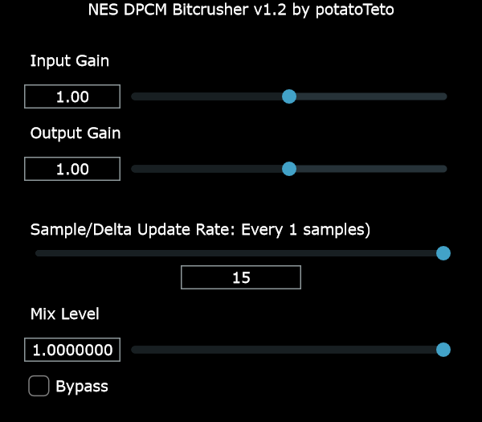

# DPCM_Bitcrusher



A JUCE-based **VST3 / Standalone plugin** that replicates the classic **DPCM (Differential Pulse-Code Modulation)** bitcrushing effect heard on the NES 2A03 sound chip.

---

## Download

Download the latest prebuilt binaries and archives from the [Releases page](https://github.com/potatoTeto/DPCM_Bitcrusher/releases).
---

## Overview

**DPCM_Bitcrusher** uses a similar algorithm to **FamiTracker** to emulate the NES DPCM channel sound characteristics. While there are some subtle audible differences, the effect should still be hardware-accurate and brings authentic NES-style bitcrushing to your DAW projects.

---

## Building from Source

### Dependencies

- [JUCE](https://juce.com/) — Required to compile the project.

### Instructions

1. Clone the repository:
    ```sh
    git clone https://github.com/your-username/DPCM_Bitcrusher.git
    cd DPCM_Bitcrusher
    ```

2. Ensure **Visual Studio 2022** (or compatible version) is installed and added to your system PATH.

3. Run the build and packaging script in PowerShell, passing the version tag as an argument:
    ```powershell
    ./build-and-package.ps1 v1.0.0
    ```
    Replace `v1.0.0` with your desired version string.

4. The compiled binaries and packaged archives will be created in the `publish` folder.

---

## License

This project is licensed under the MIT License. See the [LICENSE](LICENSE) file for details.

---

## Contact & Maintenance

I currently have no plans to actively maintain this repository, but **Pull Requests are always welcome**! For questions or issues, please open an issue on the GitHub repository.
